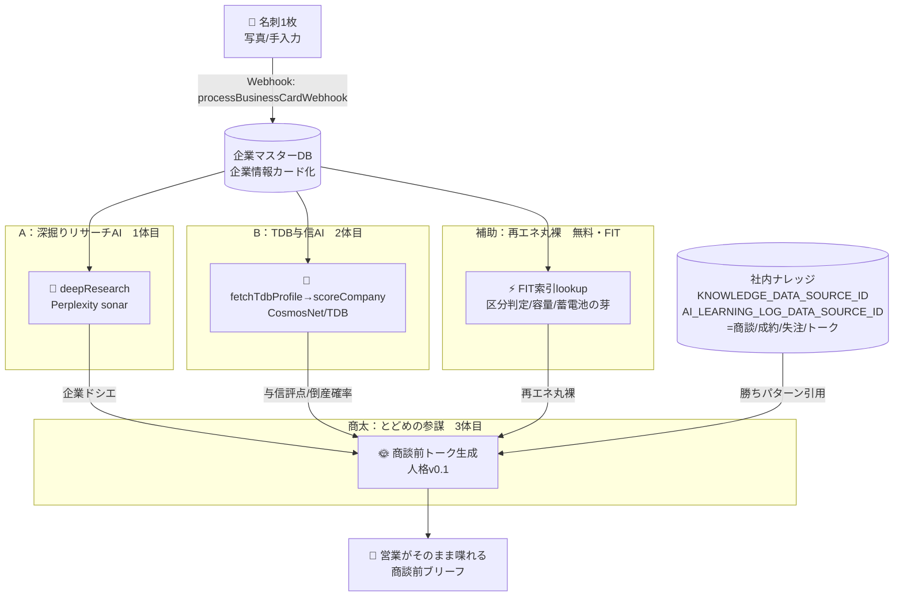

# A→B→商太 パイプライン 全体フロー図＆検証計画書（2026-06-08）

> 大ちゃん指示：**商太に走る前に、A・Bのトリガー／品質／安全性を確かめる。順番はA→B→商太。**
> このファイル＝「走る前の地図」。事実はソース(`src/index.ts`)で確認済み。推測は「推測」と明記。

## 1. 全体フロー（名刺1枚 → 営業が喋れるトーク）

## 2. 各段の検証チェックポイント（トリガー／品質／安全性）と現状

### A：深掘りリサーチAI（Perplexity sonar）
- **トリガー**：`processBusinessCardWebhook` 経由 or 企業DBボタン →（推測）企業作成/ボタンで起動
- **品質**：`normalizeDeepResearch`＋`isDeepResearchComplete`＋複数観点を`perplexityChat`で合成＋出典付与
- **安全性**：`validateResearchTarget`＝**自社(和上)はNG**（論理矛盾を弾く）／テスト企業除外
- **フォールバック**：`PERPLEXITY_API_KEY`無→`fallbackDeepResearch`（本番影響ゼロで安全劣化）
- **現状**：実装○。ただし**鍵がローカル`.env`に無い**＝Notion Worker側シークレットの有無を要確認。鍵あれば即・実1社で検証可。
- **✅検証項目**：①ボタン/webhookで確実に発火 ②出力にハルシネーション無・出典付く ③自社/対象外がNGになる ④PII漏れ無し

### B：TDB与信AI（CosmosNet）
- **トリガー**：A完了後/与信ボタン → `fetchTdbProfile`(TDB_FETCHER_URL) → `scoreCompany`
- **品質**：TDB評点・倒産確率%から自動与信判定（根拠文つき）
- **安全性**：**管理職×有効取引先ゲート**（`MANAGER_USER_IDS`は`.env`にあり）／`TDB_ALLOW_PURCHASE`で課金制御
- **⚠️現状＝本丸ブロッカー**：`TDB_FETCHER_URL`未設定＋**CosmosNet実画面セレクタ未マッピング（MAPPED=false）**＝今は**暫定与信のみ**（評点null）。実取得には**大ちゃん立会いの実画面マッピング**が必要。
- **✅検証項目**：①実画面セレクタ確定→実取得が動く ②評点/倒産確率が正確 ③ゲート（権限外は不可・無課金で誤実行しない）

### 商太：とどめの参謀（3体目）
- **トリガー**：A＋B＋丸裸＋社内ナレッジが揃った後
- **品質**：商談前トーク（つかみ/質問/反論つぶし/次手）。営業が現場で使えるか＝判定基準
- **安全性**：人格に**出典明示・断定回避・個人情報を外に出さない**を内蔵（`SHOUTA_PERSONA.md` v0.1）
- **現状**：顔○・役割○・**人格v0.1（今日作成）**。社内ナレッジDBへの**配線はこれから**。今は丸裸＋ドメイン知識で喋れる（ショータ＝日本エコのデモ実績あり）。
- **✅検証項目**：①A・Bの出力を正しく食える ②ナレッジから勝ちパターンを引用 ③トークが"使える"水準

## 3. 結論：全部グリーン（2026-06-08 大ちゃん訂正を反映）

**重要な訂正**：Bは「詰まり」ではない。**設計通りの"奥の手"**。前スレ8時間で**無料スタック（=既定・全リード）が装備完了**しており、Bは"評点だけ"のための管理職限定・課金レイヤー。

- 🟢 **A 深掘りリサーチ（無料の主力）**：装備・配線済（`processCompanyResearchWebhook`）。役員/SNS/ニュース/再エネ接点/決裁者まで収集。**これが情報収集の本体。**
  - **2026-06-08 実機ライブ検証済**：実Perplexity(キーはWorker env登録済)で19秒実走・出典50件超。未実在社では**捏造せず「未確認法人」と正直判定**＋「推測ですが」＋同名他社の取り違え警告。**品質・安全とも合格（営業に渡して事故らない）。** ロジックテスト(guard/parse/merge)も緑。
- 🟢 **B TDB与信（奥の手）**：設計通り＝**管理職×有効取引先のみ**・1社1,320〜1,760円(CCR+3,300円)。三重安全弁は取得部品側に実装。**現状 `TDB_FETCHER_URL` 未設定＝課金事故リスクゼロ**。重要顧客に管理職が意図的に発火させる運用。詰まりではなく"温存"。
- 🟢 **補助 再エネ丸裸（無料・FIT）**：装備済。今日5社で実証（日本エコ=99kW実ヒット）。
- 🟢→🟡 **商太 とどめ**：顔・役割・人格v0.1＋**喋れる本体できた**（`src/shouta-brief.ts`／LLM自動選択OpenAI→Perplexity）。2026-06-08実走で日本エコシステムのトーク生成→つかみ「2039年調達満了の出口は？」で"使える"到達。**残＝社内ナレッジ配線＋Worker(index.ts)統合＋トリガー接続**。
- ⬜ **任意の上積み**（差すだけの枠）：gBizINFO/法人番号コネクタ（無料で"質"をさらに底上げ）。Worker側の管理職資格ゲート（Part1-A）も小タスクとして残（※現状URL未設定で事故リスクは無い）。

> 次の一手の候補：**①A を実1社で発火させ品質・安全を体感** ／ **②商太 の本配線（A出力＋ナレッジ→トーク）** ／ **③無料の上積み（gBizINFO）**。Bは必要な案件で管理職が使う"運用"なので、今は触らず温存でOK。
